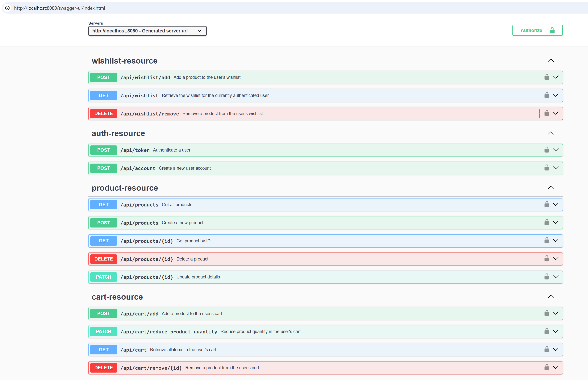
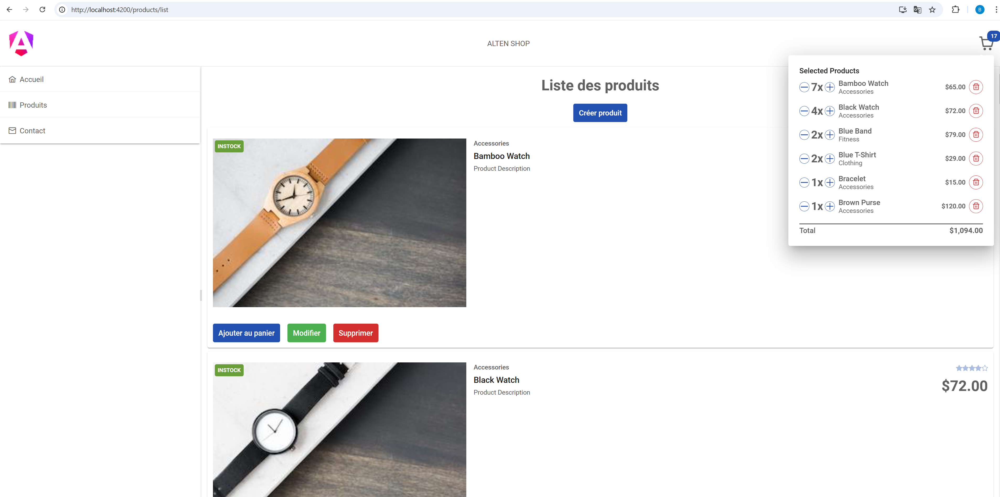

# Kata E-Commerce Project

For this kata, I worked on both the front-end and back-end. Below are the details of the work done and how to test the application:

- Front-end: Implemented features for displaying products, managing the cart, and creating the contact form.
- Back-end: Developed an API for product management, JWT authentication, and handling the user's cart and wishlist.


## Run backend app locally

```bash
git clone https://github.com/benabdesslem/kata.git
cd kata/producttrial-be
./mvnw package
java -jar target/*.jar
```

Or you can run it from Maven directly using the Spring Boot Maven plugin:

```bash
./mvnw spring-boot:run
```

Once the application is running, access the Swagger UI at http://localhost:8080/swagger-ui/index.html. To interact with
the API, first create an account and authenticate using the login endpoint to retrieve your token. Then, click the "
Authorize" button in Swagger UI and enter the token. After authorization, you can use the API to perform actions such as
creating, updating, and deleting products, as well as managing your cart and wishlist directly from the Swagger
interface.



# APIs Used

### User Creation API

- **Endpoint:** `POST /api/account`
- **Description:** Creates a new user by providing necessary information (username, first name, email, password).
- **Payload:**

```json
{
  "username": "marwen",
  "firstname": "marwen",
  "email": "admin@admin.com",
  "password": "password456"
}
````

### JWT Token Generation API

- **Endpoint:** `POST /api/token`
- **Description:** Retrieves a JWT token for authenticating subsequent operations.
- **Payload:**

```json
{
  "email": "admin@admin.com",
  "password": "password456"
}
````

### Product Creation API

- **Endpoint:** `POST /api/products`
- **Description:** Creates a product by defining its attributes, such as code, name, description, image, category,
  price, etc.
- **Payload:**

```json
{
  "id": null,
  "code": "PRD001",
  "name": "Laptop",
  "description": "High-performance laptop with 16GB RAM and 512GB SSD.",
  "image": "https://example.com/images/laptop.png",
  "category": "Electronics",
  "price": 1299.99,
  "quantity": 50,
  "internalReference": "LPT-2024",
  "shellId": 10,
  "inventoryStatus": "INSTOCK",
  "rating": 4.8,
  "createdAt": "2024-12-28T12:00:00.000Z",
  "updatedAt": "2024-12-29T10:15:00.000Z"
}
````

### Get Products API

- **Endpoint:** `GET /api/products`
- **Description:** Returns a list of all existing products.

### Update Product API

- **Endpoint:** `PATCH /api/products/{id}`
- **Description:** Updates the details of a specific product identified by its id.
- **Payload:**

```json
{
  "id": 1,
  "code": "PRD001",
  "name": "Laptop",
  "description": "Updated description: Sleek and powerful laptop with enhanced graphics performance.",
  "image": "https://example.com/images/laptop.png",
  "category": "Electronics",
  "price": 1299.99,
  "quantity": 50,
  "internalReference": "LPT-2024",
  "shellId": 10,
  "inventoryStatus": "INSTOCK",
  "rating": 4.8,
  "createdAt": "2024-12-29T14:37:46.583427+01:00",
  "updatedAt": "2024-12-29T10:15:00Z"
}
````

### Delete Product API

- **Endpoint:** `DELETE /api/products/{id}`
- **Description:** Deletes a specific product by its id.

### Add to Cart API

- **Endpoint:** `POST /api/cart/add?productId={id}`
- **Description:** Adds a product to the cart using its ID.

### Reduce Cart Quantity API

- **Endpoint:** `PATCH /api/cart/reduce-product-quantity?productId={id}`
- **Description:** Reduces the quantity of a specific product in the cart.

### Remove from Cart API

- **Endpoint:** `DELETE /api/cart/remove/{id}`
- **Description:** Removes a product from the cart by its ID.

### Get Cart API

- **Endpoint:** `GET /api/cart`
- **Description:** Returns the content of the current cart.

### Add to Wishlist API

- **Endpoint:** `POST /api/wishlist/add`
- **Description:** Adds a product to the wishlist.
- **Payload:**

```json
{
  "productId": 2
}
```

### Remove from Wishlist API

- **Endpoint:** `DELETE /api/wishlist/remove?productId={id}`
- **Description:** Removes a product from the wishlist.

### Get Wishlist API

- **Endpoint:** `GET /api/wishlist`
- **Description:** Returns the list of products in the wishlist.

# API Test Script

## Script Overview

This script performs several actions to test and interact with the API. It includes the following functionalities:

- **Create a User**: Calls the `POST /api/account` endpoint to create a new user.
- **Obtain a JWT Token**: Calls the `POST /api/token` endpoint to retrieve a JWT token for authentication.
- **Create, Update, and Delete Products**: Calls various `POST`, `PATCH`, and `DELETE` endpoints to manage products in
  the system.
- **Manage Shopping Cart**: Allows adding, removing, and updating the quantities of products in the shopping cart.
- **Manage Wishlist**: Allows adding and removing products from the wishlist.

## Requirements

- `curl` (Command-line tool for making HTTP requests)

## Script Details

The script will execute the following actions:

1. **Create a new user** by sending a `POST` request to the `/api/account` endpoint.
2. **Obtain a JWT token** for authentication by calling the `/api/token` endpoint.
3. **Create products** via the `/api/products` `POST` endpoint.
4. **Update product details** by sending a `PATCH` request to the `/api/products/{id}` endpoint.
5. **Delete products** by sending a `DELETE` request to the `/api/products/{id}` endpoint.
6. **Manage the shopping cart** by adding, removing, or updating product quantities using the appropriate endpoints.
7. **Manage the wishlist** by adding or removing products from the wishlist via the `/api/wishlist` endpoints.

## Running the Script

To run the script, simply execute the following command:

```bash
./test_api.sh
````


#### Testing:

- Unit tests are added for the service layer.
- Integration tests are included for the resources.

#### Database Configuration:

- In-memory H2 database is used for development.
- In-memory H2 database is utilized for unit tests.

## Front-End

The front-end is built to allow users to interact with the e-commerce platform, including:
- Viewing product details.
- Adding/removing products to/from the cart.
- Displaying the cart's quantity badge.
- Viewing the cart content.
- Creating a "Contact" page with a form to send inquiries.

### To run the front-end:
1. Clone the repository.
2. Install dependencies:
   ```bash
   npm install
   ```
3. Start the development server:
   ```bash
   npm run start
   ```
3. Open your browser and navigate to http://localhost:3000 to test the application.

